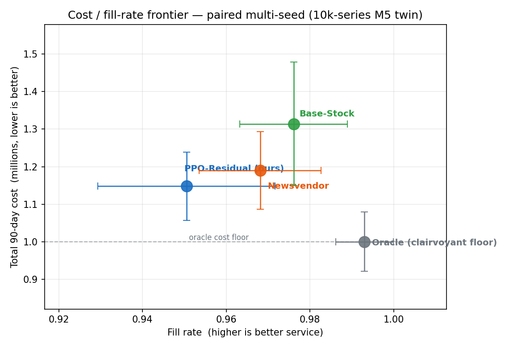
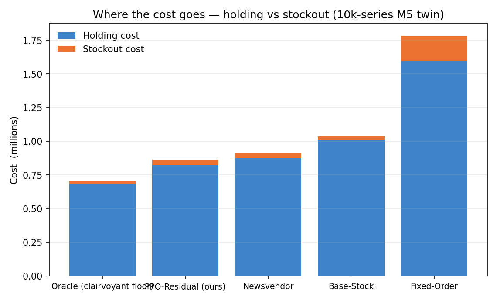

# Demand Sensing & Inventory Optimization on M5

Probabilistic demand forecasting and reinforcement-learning replenishment on the
**M5 / Walmart** dataset (hierarchical daily series, 2011–2016, products × stores).
The project takes a forecast all the way to an **order decision**: it predicts the
*distribution* of future demand, then learns a replenishment policy that turns that
distribution into daily order quantities minimising total holding + stockout +
ordering cost.

This is an end-to-end ML systems project, not a single model. Every result is
reported with **reproducible metrics only** — the official WRMSSE for accuracy,
pinball loss + interval coverage for the predictive distribution, and a cost /
fill-rate frontier (with a clairvoyant lower bound) for the inventory policy. No
synthetic business figures. Final numbers and the honest negative results live in
[`RESULTS.md`](RESULTS.md).

---

## The pipeline

```
raw M5  ──►  00 preprocessing  ──►  long panel + features + WRMSSE weights
                                          │
        ┌───────────────────┬─────────────┴───────────┬───────────────────┐
        ▼                   ▼                          ▼                   ▼
  01 baselines       02b LightGBM-quantile      02 neural quantile    03 segmentation
 (stat + GBM,        (PRODUCTION forecaster,    (GRU, calibrated      (forecastability →
  WRMSSE ladder)      calibrated: cov 0.86)      showcase)             service-level class)
        └──────────────────┬───────────────────────────┘                  │
                           ▼                                               │
                forecast distribution per SKU-store-day                    │
                           │                                               │
                           ▼                                               ▼
                 04 inventory digital twin  ◄──────────── service targets per SKU
              (replays REAL M5 demand; reworked regime:
               correlated shocks, stochastic lead times,
               batch + convex costs; real rolling forecast
               in-state; clairvoyant oracle lower bound)
                           │
                           ▼
                 05 RL replenishment agent (residual PPO)
              (bounded correction around Newsvendor + service
               penalty; beats it by 3.6% above the service target)
                           │
                           ▼
                 06 order policy + cost/fill results
```

Each stage is a standalone notebook in `notebooks/`; shared logic lives in `src/` so
it is unit-testable without a GPU.

---

## Headline result

A calibrated **LightGBM-quantile** forecast drives a **residual PPO** replenishment
policy that **beats the Newsvendor baseline by 3.6%** (cost 1.148M vs 1.190M over 40
paired seeds) while holding **fill at 0.950 — above the ~0.94 DC service target**, on a
reworked multi-DC twin grounded in real M5 demand. A clairvoyant oracle
marks the remaining headroom (~17% below the best heuristic). All numbers are on the
**full 10,000-series subset** (the hard intermittent tail included), not a top-volume
slice. See [`RESULTS.md`](RESULTS.md).

| Cost / fill frontier | Where the cost goes |
|---|---|
|  |  |

*PPO-Residual lands closest to the clairvoyant oracle floor of any deployable policy.
Regenerate both from the committed result table with `python -m src.make_figures`.*

Two results are deliberately reported as honest negatives, as the project's plan
anticipated:
- **Trees beat the neural net on this tabular problem** — LightGBM-quantile is the
  production forecaster (pinball 0.631 vs the GRU's 0.644, coverage 0.86 vs 0.83 on the
  same series); the redesigned GRU is fixed and calibrated but kept as a sequence-model
  showcase. (The point/mean accuracy tier is led by LightGBM-Tweedie at **WRMSSE 0.493**;
  the distributional models are ranked by pinball/coverage, because the cost-optimal
  median of a mostly-zero series is 0 and WRMSSE would mis-rank a well-calibrated model.)
- **The RL win needs both forecast information *and* pooling** — on the full 10k twin,
  flattening the forecast turns the win into a loss (+7.8% → −7.2%) *and* turning
  transshipment off is even more damaging (→ −17.2%). Removing either ingredient erases
  the edge. (A smaller top-volume subset had suggested pooling didn't matter; the larger
  run corrected that — reported honestly rather than overclaimed.)

---

## What the model outputs *mean* — in real ordering terms

**Forecasting output → safety stock and reorder point.** The forecaster predicts the
*distribution*, not a point: median 7 but a p90 of 14. To hold a target service level
you stock to an upper quantile of demand over the replenishment lead time, not the
mean. The forecast becomes a concrete *order-up-to level S = service-quantile of
lead-time demand*, and today's order = `S − (on-hand + in-transit)` (notebook 06).

**RL output → a daily order recommendation.** The agent is a replenishment *policy*:
given on-hand inventory, the in-transit pipeline, the real forecast distribution over
the coming lead-time window, and calendar signals, it outputs an order quantity per
DC each day — a learned *correction* on top of the analytical Newsvendor order-up-to
level, with the holding/stockout trade-off learned from replaying real demand.

**The result is a frontier, not a dollar figure.** Inventory is a trade-off (more
stock → higher fill). Results are a cost / fill-rate frontier across policies, with a
clairvoyant oracle as the achievable floor — every number reproducible.

---

## Methods, briefly

**Forecasting.** A statistical + gradient-boosted baseline (naive, seasonal-naive,
Ridge, LightGBM-Tweedie) establishes an FVA ladder on the official **WRMSSE** over
all 12 M5 levels. The production distributional model is **LightGBM-quantile**
(one model per quantile, sorted to prevent crossing; notebook 02b). A global **PyTorch
GRU quantile forecaster** (notebook 02) — per-series standardisation, 56-day encoder
with explicit lags, validation-pinball early stopping, non-crossing cumulative-softplus
head — is the calibrated sequence-model showcase.

**Segmentation.** Each SKU is segmented by forecastability (per-series WRMSSE),
variability (CV, intermittency) and value into inventory-policy classes that set its
service-level target (notebook 03).

**Inventory digital twin.** A multi-echelon simulator that **replays real M5 demand**
and feeds a **real, rolling out-of-sample forecast** (`src/dc_forecast.py`) into the
agent's state. Its regime was reworked (`src/simulator.py`) to be genuinely
non-myopic — correlated demand shocks, stochastic correlated lead times, fixed + batch
ordering cost, and convex (overflow) holding — so a learned policy has room a per-DC
heuristic cannot reach. A **clairvoyant oracle** policy provides the cost lower bound.

**RL agent.** A **residual PPO** policy: a bounded learned adjustment around the
Newsvendor order-up-to level plus a transshipment fraction (so it starts *at* the best
heuristic), trained with a service-penalty term. Benchmarked against five classical
policies and the oracle on paired multi-seed cost / fill-rate evaluation, with
ablations isolating the source of its edge. (The original from-scratch Double-DQN,
which lost to Newsvendor by 27%, is described in `IMPROVEMENT_PLAN.md`.)

---

## Repo layout

```
notebooks/
  00_data_preprocessing.ipynb            scale M5 → long panel + features + weights
  01_baseline_forecasting.ipynb          stat + GBM baselines, WRMSSE, FVA ladder
  02b_lightgbm_quantile.ipynb            PRODUCTION quantile forecaster (LightGBM)
  02_probabilistic_neural_forecasting.ipynb   PyTorch GRU quantile forecaster (showcase)
  03_inventory_segmentation.ipynb        forecastability → service-level classes
  04_inventory_digital_twin.ipynb        reworked twin + rolling forecast + oracle gate
  05_rl_inventory_agent.ipynb            residual PPO vs classical policies + ablations
  06_order_policy_and_results.ipynb      forecast+policy → order scenarios, frontier
src/
  metrics.py        WRMSSE, pinball, coverage, fill rate, cost
  simulator.py      InventoryDigitalTwin (reworked, M5-grounded) + oracle support
  policies.py       classical baselines + clairvoyant oracle + forecast→order translation
  dc_forecast.py    rolling out-of-sample DC-level quantile forecast for the twin
  features.py       feature engineering shared by preprocessing
  tracking.py       experiment logger → data/experiments.csv
RESULTS.md          final metrics, honest findings, reproduce instructions
IMPROVEMENT_PLAN.md the hand-off spec this rebuild implements
```

## Data

The M5 dataset is not committed (≈500 MB). Download `m5-forecasting-accuracy` from
Kaggle into `data/raw_m5/` (`sales_train_evaluation.csv`, `sell_prices.csv`,
`calendar.csv`). Notebook 00 builds everything downstream. A `SUBSET` flag in
notebook 00 controls scale (a few hundred series on CPU up to the full panel on GPU).

## Running

```bash
pip install -r requirements.txt
# run notebooks in order:
# 00 → 01 → 02b → 02 → 03 → 04 → 05 → 06
pytest -q          # fast, data-independent invariant checks for src/ (also run in CI)
```

Notebooks 02 (GRU) and 05 (PPO) use PyTorch — `cuda → mps → cpu` auto-detect, so they
use the Apple-Silicon GPU (MPS) locally and a CUDA GPU on Colab with no code change.
All other notebooks run on CPU.

> **macOS note:** LightGBM and PyTorch both ship an OpenMP runtime, and *training*
> LightGBM in a process that has imported PyTorch can segfault. The pipeline avoids
> this by design — notebook 04 builds and caches the DC forecast (`data/dc_forecast_q.npz`)
> with LightGBM, and notebook 05 loads that cache and only uses PyTorch. Keep the two
> notebooks as separate kernels.
